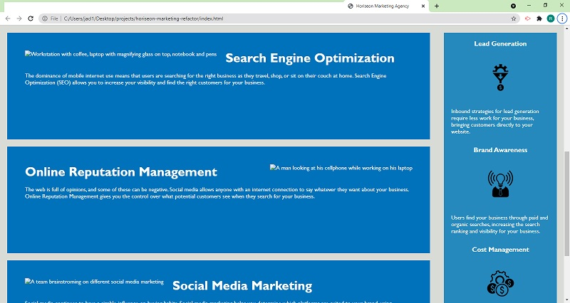

# Horiseon Marketing Refactor Project

This project is to refactor existing Horieson Marketing Agency's webpage to incorporate sustainability and accessibility to its codebase enabling an enhanced site 
experience for its users and clients. The tasks involves applying semantic standards to the code and ensure all functionality are working as it should be. 
These changes should be reflected using CSS selector standards in an efficient and optimized flow structure for readability and sustainability.

The successful completion of the project is reflected hereto based on the following changes outlined here:

## Outline of the implemented HTML and CSS acceptance criteria

* Implemented the accessibility requirement by replacing tag elements in the code with semantic elements.

* Re-structure the html code to follow a more logical structure that's independent of the styling and positioning by using approriate semantic elements based on the functionality of the page.
[Page Dislay](https://drive.google.com/file/d/1jOi0LZebiK6ZGwKquCPw-UlLZS7_lX4U/view?usp=sharing)

* Icon and images were  provided alternative attributes for the required accessibility criteria.

* Provided an identifiable title that represents the webpage content.
 

* Optimized the CSS selectors and attributes to follow html code structure by consolidating similar attributes.

